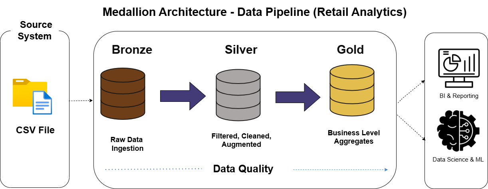
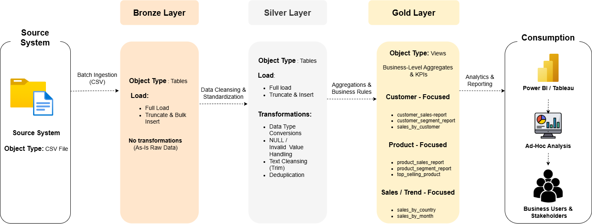

# Data Warehouse & Analytics Project

Welcome! 🚀  
This project demonstrates a complete data warehousing and analytics workflow using SQL Server, from raw data ingestion to actionable business insights.

## Project Objective
Build a modern data warehouse and deliver SQL-based analytics to understand:

- Customer behavior  
- Product performance  
- Sales trends  

## Dataset
The raw sales dataset used is available in the [dataset](dataset) folder:  

- `online_retail.csv` – raw transactional sales data.

## Project Architecture

### Data Flow

### Data Architecture

## Layers Overview

### Bronze Layer
- **Type:** Table  
- **Purpose:** Raw data ingestion from CSV  
- **Process:** Full load (truncate & insert), no transformation

### Silver Layer
- **Type:** Table  
- **Purpose:** Cleaned, typed, and analytics-ready data  
- **Process:** Null handling, type conversion, trimming, deduplication, data validation

### Gold Layer
- **Type:** Views  
- **Purpose:** Business-level KPIs & aggregates  
- **Process:** Generate customer, product, and sales insights, including business-level metrics and segmentation

## How to Reproduce / Run
1. Clone the repository to your local machine.  
2. Place the raw CSV (`online_retail.csv`) in the `/dataset` folder (already included).  
3. Use SQL Server to run the scripts in order:
   - **Bronze Layer:** `bronze.proc_load_bronze_online_retail`  
   - **Silver Layer:** `silver.proc_load_silver_online_retail`  
   - **Gold Layer:** Views to generate analytical reports.  
4. Use the diagrams in `/docs` to understand data flow and architecture.

## License
MIT License – free to use with attribution.

## About Me
Hi! I'm Meenakshi Singh, an aspiring Data Analyst with expertise in SQL and Excel. This project demonstrates my ability to transform raw data into meaningful business insights, applying real-world data warehousing and analytics concepts.
